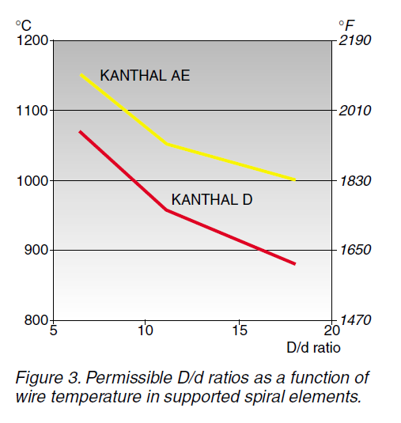

# kiln_controller
Connected electric kiln controller -> esp8266, max31855, thermocouple type K, relay, contactor and energy meter. Including Kiln built plans.

 ## TODO

- [ ] Temperature Ramp rate monitor;
- [ ] Cooling monitor;
- [ ] Cool upload progress: https://codepen.io/takaneichinose/pen/jOWXBBd

## VOID

"Lorem ipsum dolor sit amet, consectetur adipiscing elit, sed do eiusmod tempor incididunt ut labore et dolore magna aliqua. Ut enim ad minim veniam, quis nostrud exercitation ullamco laboris nisi ut aliquip ex ea commodo consequat. Duis aute irure dolor in reprehenderit in voluptate velit esse cillum dolore eu fugiat nulla pariatur. Excepteur sint occaecat cupidatat non proident, sunt in culpa qui officia deserunt mollit anim id est laborum."

## Bil of materials

Description | Price
------------ | -------------
[4x Modules enclosure](https://www.amazon.de/gp/product/B07K5X5KZQ/ref=ppx_yo_dt_b_asin_title_o00_s00?ie=UTF8&psc=1) | €8.00
[Energy meter with S0 output](https://www.amazon.de/gp/product/B083H7NT2R/ref=ppx_yo_dt_b_asin_title_o00_s01?ie=UTF8&psc=1) | €13.00
[HDR-15 Power Supply](https://www.amazon.de/gp/product/B06XWQSJGW/ref=ppx_yo_dt_b_asin_title_o00_s00?ie=UTF8&psc=1) | €13.00
[AC contactor](https://www.amazon.de/gp/product/B07GXM2Q3S/ref=ppx_yo_dt_b_asin_title_o00_s00?ie=UTF8&psc=1) | €10.00
esp8266 | €5.00
max31855 | €10.00
[Type-K thermocouple](https://www.keramik-kraft.com/en/Kiln-Building--Repair/Pyrometry/Thermocouple-Nickel-Typ-K/Thermocouple-Type-K-open-with-flange-l-12cm.html?sel=13) | €50.00
Cables, terminals, etc | €10.00

Total: **€120.00**

## Calculations

### Element power

* This is determined by the unchanged power outlet, i.e `230Vac@10A` -> **2300W**

* Some [resources](https://knifedogs.com/threads/heat-treat-oven-how-to-design-and-calculate-the-heating-elements.21072/) indicate 0.6 - 1.3 W/cm2 of wall -> `Aw = (7.38 * 12) * 34.5 = 3,055.32 cm2` therefore Element should be between *1833W* and *4000W*, 2400W gives **0.79 W/cm2**

* [KMT-614](https://skutt.com/products-page/ceramic-kilns/kmt-614/) and [Ecotop 20](https://www.rohde.eu/en/arts-and-crafts/products/toploaders/ecotop-series/ecotop-20) are both ~20L with 2300W element and rated to [Cone 6](https://www.ortonceramic.com/files/2676/File/orton-cone-chart-2016.pdf), aka ~1260°C

### Element size

Using Kanthal A1

* 1mm -> R = 1.85 Ohms/m
* L = ( 2300 / 10^2 ) / 1.85 = **~12.5m**

### Surface Load

* Accordingly to Kanthal [datasheet](./extras/Kanthal%20handbook.pdf), kiln application should have a Surface Load between 3-9 W/cm2:

`2300 / (2pi x 0.05 x 1300) = **5.88**W/cm2`

* [furnace handbook](./extras/file1359965681_U3423.pdf) page 7 indicates max 2.4W/cm2 @ 1100°C

### Coil Diameter

* In order to avoid deformation on horizontal coils, the coild diameter should stay below 10mm accordingly to:

 

* Therefore let's use a **M8** rod to coil the wire.

### Coil Length

* The internal element perimeter is ~940mm, if 3x turns are planned, we end up with a **2830mm** coil;

### Coil Pitch

*Coil pitch is normally 2-4 times the wire diameter* [page_79](./extras/Kanthal20handbook.pdf) -> aka 2-4mm

`s = 7 x pi / sqrt((12500 / 2820) ^ 2 - 1) = **5.1mm**`

**!!!!! MAYBE should go with 2 turns? - shorter length**
**OR make 2x circuits in parallel - reduce surface load as well (2-2.5W/cm2) https://kruegerpottery.com/products/element_240v_16amp**
**OR use thicker wire**

## Known Limitations

* 

## Credits

Github Shields and Badges created with [Shields.io](https://github.com/badges/shields/)
